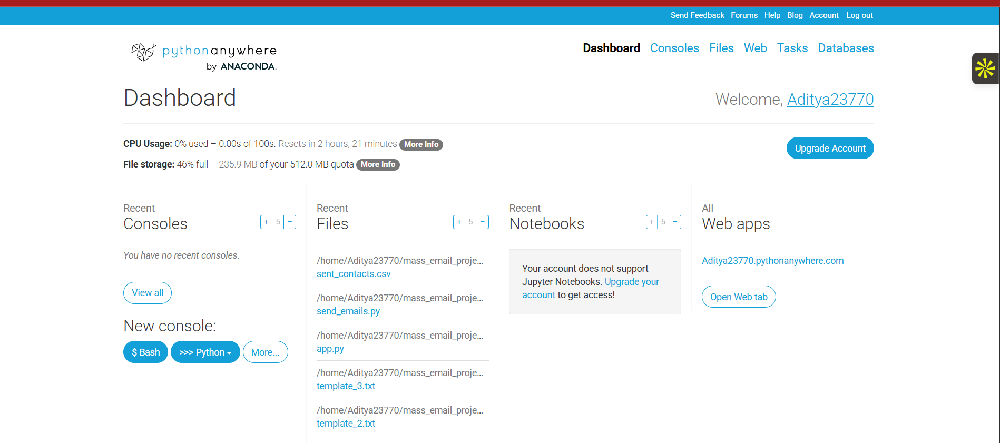
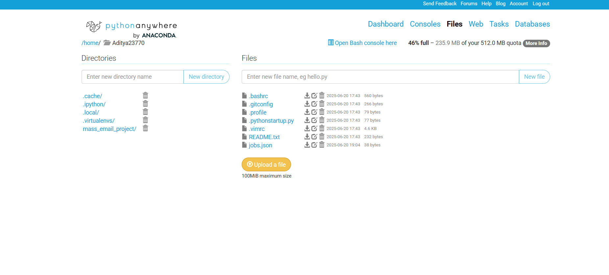
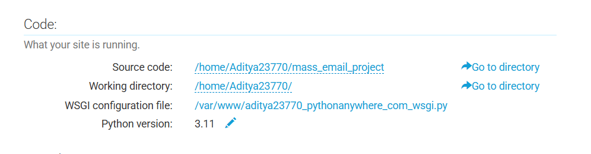
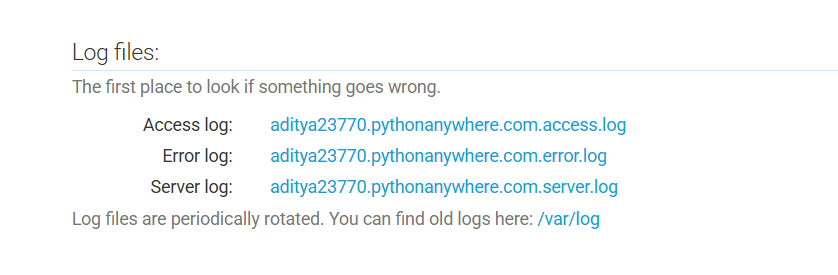

# Mass Emailer — Cold Email Automation Tool

A Flask web app that sends personalized cold emails for job applications. Manages your contact list, rotates templates, attaches your resume, and tracks who has already been contacted.

---

## Features

- Multiple email templates rotated automatically per contact
- CSV-based contact list with duplicate-send prevention
- PDF resume attached to every email
- Configurable delay between sends to avoid spam filters
- Web UI to trigger sends, monitor status, and view logs
- WSGI-ready for free hosting on PythonAnywhere

---

## Project Structure

```
mass_emailer_cron/
├── app.py                  # Flask web app (main entry point)
├── send_emails.py          # Email sending engine
├── scheduled_task.py       # Background job runner
├── wsgi.py                 # WSGI config for PythonAnywhere
├── requirements.txt        # Python dependencies
├── .env.example            # Copy this to .env and fill in your values
├── config.example.json     # Copy this to config.json and fill in your values
├── contacts_example.csv    # Demo contacts — copy to filtered_contacts.csv
├── example_resume.pdf      # Demo resume PDF — replace with yours
├── template_1.txt          # Email template 1
├── template_2.txt          # Email template 2
├── template_3.txt          # Email template 3
└── templates/form.html     # Web UI
```

---

## Local Setup

```bash
git clone https://github.com/Aditya23770/mass-emailer-cron.git
cd mass_emailer_cron
pip install -r requirements.txt
cp .env.example .env                            # fill in your Gmail + sender details
cp config.example.json config.json
cp contacts_example.csv filtered_contacts.csv  # replace with real contacts
python app.py                                   # open http://localhost:5000
```

Open `.env` and fill in:

```
GMAIL_ADDRESS=your_gmail@gmail.com
GMAIL_APP_PASSWORD=xxxx xxxx xxxx xxxx
SENDER_NAME=Your Full Name
SENDER_PHONE=+91-XXXXXXXXXX
SENDER_LINKEDIN=linkedin.com/in/your-profile
SENDER_GITHUB=github.com/YourUsername
RESUME_PATH=example_resume.pdf
```

---

## Gmail App Password Setup

> **Why not use your normal Gmail password?**
> Google blocks external apps from using your real password. An **App Password** is a special 16-character token Google generates just for this app — it lets the tool send emails on your behalf without exposing your real password. You can revoke it anytime without changing your main password.

**Steps:**

1. Go to [myaccount.google.com](https://myaccount.google.com) → **Security**
2. Enable **2-Step Verification** (required first)
3. Go back to Security → **App passwords**
4. App name: type `mass-emailer` → click **Generate**
5. Copy the 16-character password shown (e.g. `abcd efgh ijkl mnop`)
6. Paste it into `.env` as `GMAIL_APP_PASSWORD`

> Keep this secret — anyone with it can send emails from your Gmail account.

---

## Email Templates

Edit `template_1.txt`, `template_2.txt`, `template_3.txt` to match your background. The tool cycles through them in order so each contact gets a slightly different email.

| Placeholder | Replaced with |
|---|---|
| `{name}` | Recipient's name |
| `{company}` | Company name |
| `{sender_name}` | Your name (from `.env`) |
| `{sender_phone}` | Your phone (from `.env`) |
| `{sender_linkedin}` | Your LinkedIn (from `.env`) |
| `{sender_github}` | Your GitHub (from `.env`) |

---

## How to Get HR / Recruiter Contacts

Your `filtered_contacts.csv` needs three columns: `Name`, `Email`, `Company`.

**Recommended sourcing tools:**

### 1. Topmate.io

[Topmate.io](https://topmate.io) is a platform where industry professionals sell curated recruiter and HR contact lists. These products come with verified emails across industries — download the list, map the columns to `Name`, `Email`, `Company`, and it's ready to drop straight into this tool.

- **[HR Email List & Outreach Guide — Suryakant Chaurasiya](https://topmate.io/suryakant_chaurasiya/1187680)**
  Curated HR and recruiter emails across tech companies, packaged with a cold email outreach strategy. Covers multiple industries and roles (Data Science, SDE, Product). Compatible with this tool's CSV schema out of the box.

- **[Recruiter Contacts & Job Search Strategy — Narendra Barihan](https://topmate.io/narendra_barihan/2032869)**
  Verified recruiter contact list with job search guidance. Includes contacts from startups to large enterprises. Download, rename columns to `Name`, `Email`, `Company`, and you're ready to send.

### 2. Other Sources

| Platform | How to use it |
|---|---|
| [Apollo.io](https://apollo.io) | Search by job title + company, export as CSV |
| [Hunter.io](https://hunter.io) | Find verified work emails by company domain |
| LinkedIn | Connect first, then message for email |

> Only email recruiters and hiring managers. Include your contact info in every email and never mislead recipients about who you are (CAN-SPAM / GDPR).

---

## Deploying on PythonAnywhere (Free)

PythonAnywhere hosts Flask apps permanently for free — no credit card needed.

---

### Step 1 — Sign Up

Go to [pythonanywhere.com](https://www.pythonanywhere.com) → **Pricing & signup** → **Create a Beginner account** → verify your email.

---

### Step 2 — Dashboard & Open a Bash Console

After logging in you land on the Dashboard. Under **New console**, click **$ Bash**.


> *Your screen will show your own username instead of "Aditya23770"*

---

### Step 3 — Clone the Repo & Install Dependencies

In the Bash console, run these one by one:

```bash
mkvirtualenv myenv --python=python3.10
workon myenv
git clone https://github.com/Aditya23770/mass-emailer-cron.git mass_emailer_cron
pip install -r mass_emailer_cron/requirements.txt
```

---

### Step 4 — Upload Your Config, Contacts & Resume via Files Tab

Click **Files** in the top nav. Navigate into `mass_emailer_cron/` and upload:
- Your `config.json` (copy of `config.example.json` with your values)
- Your `filtered_contacts.csv`
- Your resume PDF


> *Your project folder appears under Directories after cloning. Click into it to upload files.*

---

### Step 5 — Create the Web App

1. Click **Web** in the top nav → **Add a new web app**
2. Click **Next** → choose **Manual configuration** *(NOT Flask)* → **Python 3.10** → **Next**

---

### Step 6 — Edit the WSGI File

Go to the **Web** tab → click your web app → scroll down to the **Code** section. You'll see it exactly as shown below:


> *Web tab → your app → Code section. Click the WSGI configuration file link to open the editor.*

In the editor: **select all → delete everything** → paste this:

```python
import sys
import os

sys.path.insert(0, '/home/YOUR_USERNAME/mass_emailer_cron')

from dotenv import load_dotenv
load_dotenv('/home/YOUR_USERNAME/mass_emailer_cron/.env')

from app import app as application
```

Replace `YOUR_USERNAME` with your actual PythonAnywhere username. Click **Save**.

---

### Step 7 — Set Virtualenv Path

Back on the Web tab, scroll to the **Virtualenv** section and enter:

```
/home/YOUR_USERNAME/.virtualenvs/myenv
```

Click the checkmark to save.

---

### Step 8 — Set Environment Variables

On the Web tab, scroll to **Environment variables** and add each one:

| Variable | Value |
|---|---|
| `GMAIL_ADDRESS` | your_gmail@gmail.com |
| `GMAIL_APP_PASSWORD` | xxxx xxxx xxxx xxxx |
| `SENDER_NAME` | Your Full Name |
| `SENDER_PHONE` | +91-XXXXXXXXXX |
| `SENDER_LINKEDIN` | linkedin.com/in/your-profile |
| `SENDER_GITHUB` | github.com/YourUsername |
| `RESUME_PATH` | /home/YOUR_USERNAME/mass_emailer_cron/MyResume.pdf |

---

### Step 9 — Reload & Test

Click the green **Reload** button on the Web tab. Then visit:

```
https://YOUR_USERNAME.pythonanywhere.com
```

Use **Test Mode** first to send a test email to yourself before running a full batch.

---

### Debugging — Log Files

If something goes wrong, the **Web tab** has a **Log files** section (scroll down past the Code and Virtualenv sections). It shows three clickable log links:


> *Web tab → scroll down to "Log files". This is the first place to check when something breaks.*

| Log | What it tells you |
|---|---|
| **Error log** | Python exceptions and import errors — check this first |
| **Server log** | WSGI startup messages and crashes |
| **Access log** | Every HTTP request made to your app |

Click the **Error log** link — it opens directly in the browser and shows the exact line that failed.

---

## License

MIT — free to use, modify, and share.
